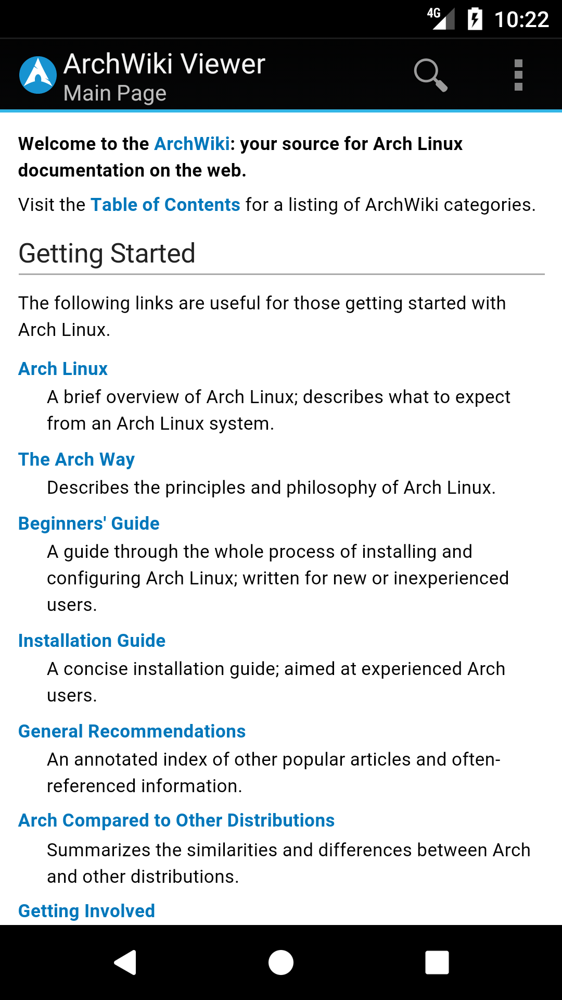
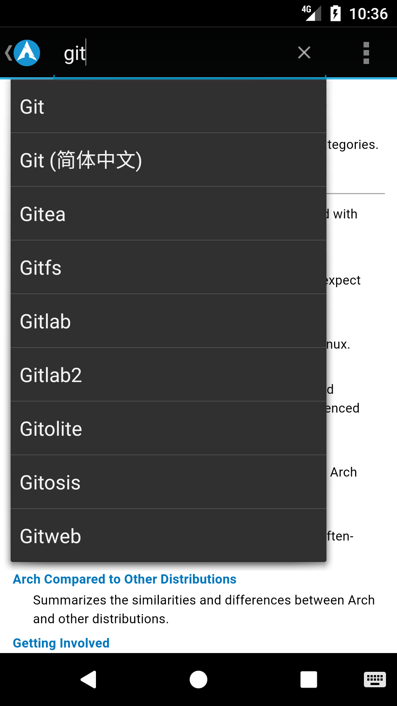
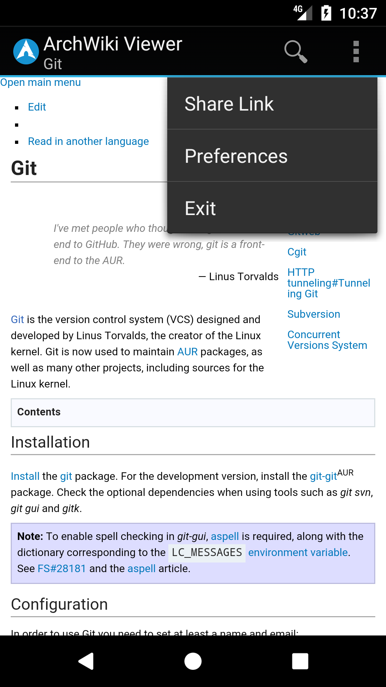

ArchWiki Viewer
===============
A simple viewer for the Arch Linux Wiki. Page content is formatted for optimal mobile viewing.

[https://play.google.com/store/apps/details?id=com.jtmcn.archwiki.viewer](https://play.google.com/store/apps/details?id=com.jtmcn.archwiki.viewer)

## Screenshots

  

## License
This project is licensed under the Apache License, Version 2.0

Copyright 2014 jtmcn

See [LICENSE.md](LICENSE.md)
