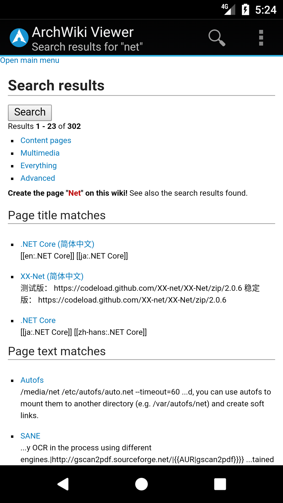
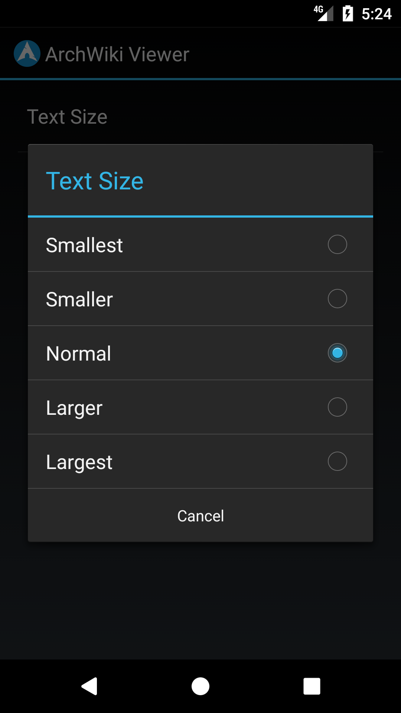

ArchWiki Viewer
===============
A simple viewer for the Arch Linux Wiki. Page content is formatted for optimal mobile viewing.

 [ ](https://f-droid.org/repository/browse/?fdid=com.jtmcn.archwiki.viewer)

## Screenshots

    

## Contributions
All contributions are welcome, don't forget to ask if you need help.

Comments and tests are highly encouraged.

## License
This project is licensed under the Apache License, Version 2.0

Copyright 2014 jtmcn

See [LICENSE.md](LICENSE.md)
